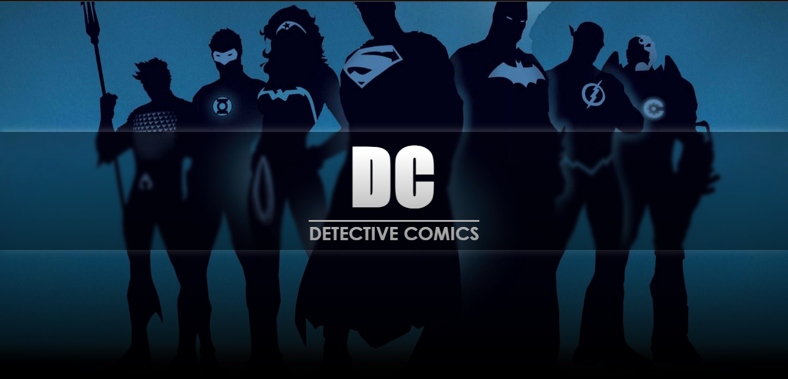
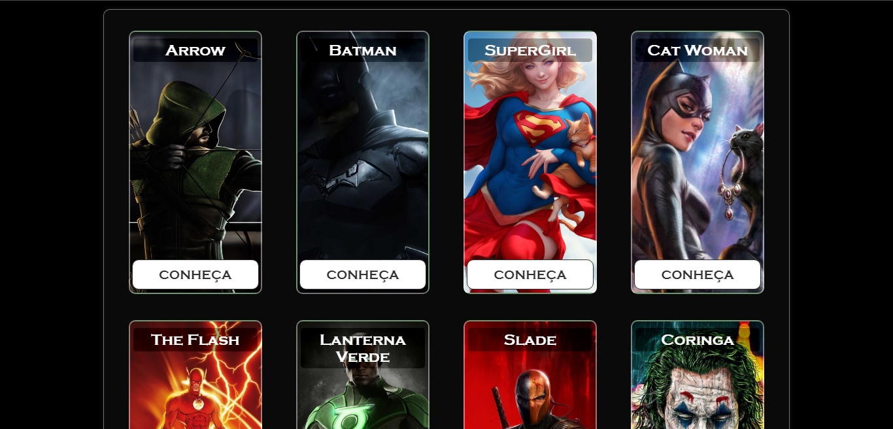
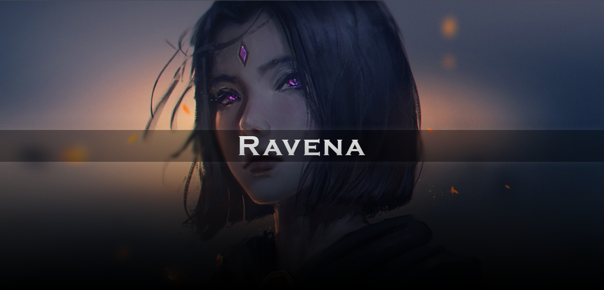
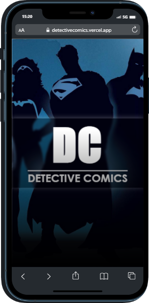

# 🦸‍♂️ Detective Comics

Esse é o meu primeiro projeto desde que iniciei a estudar programação.✨  

Existem duas versões do site, a primeira é o projeto completo inicial, já a segunda versão foi feita com base na primeira mas com algumas mudanças, pois eu já havia um pouco mais de conhecimento ao realiza-la.
#### Clique <a href= "https://detective-comics-first-version.vercel.app/"> AQUI </a>para acessar a primeira versão do projeto.  

### 📌  Você pode clicar <a href= "https://detectivecomics.vercel.app/"> AQUI </a> para acessar a versão mais recente.  

#### - ou dar uma olhadinha nos gifs do projeto, ao final do readme. <3

## ​👩‍💻​ Desenvolvimento
   Por ter sido o meu primeiro site, eu tive bastante dificuldade para ajustar os elementos e para usar as propriedades certas para estiliza-los também. Já na segunda versão eu não tive esse problema, pois eu já havia mais prática desenvolvendo outros projetos. 💡  
 📍 A responsividade foi adicionada apenas na segunda versão, visto que na primeira eu não sabia o suficiente para essa técnica.

## 💢 Demonstração
#### - Tela inicial

 

#### - Página de um dos personagens

 

#### - Responsividade (Iphone 12 PRO) 

##### Você pode conferir meus outros projetos clicando <a href= "https://anaprojetos.vercel.app/"> AQUI</a>.
#### ⚡ Estou aberta a opiniões construtivas, dicas e idéias.
## - Obrigada por ler até aqui! 💗
